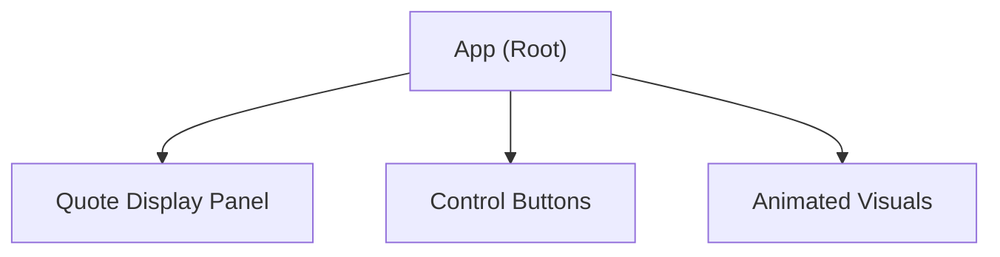

# Architecture Overview

## Introduction

The Jarvis-Inspired Quote Display App uses React to create a responsive web frontend with a modern, animated aesthetic. Its primary focus is on delivering a seamless and visually striking user experience based around a central quote display, futuristic layout, and fluid animations.

## Application Architecture

- **Frontend Framework:** React (JavaScript)
- **UI Paradigm:** Component-based, declarative rendering
- **Styling:** Modern CSS (using CSS variables for theme), with direct application-specific animation and layout styles

### Key Components

- **App (`src/App.js`):** The root component that manages the overall layout, primary theme, and the display of quotes.
- **Quote Display Panel:** A central component—implemented as a part of the main App—which shows the current quote against a themed background.
- **Control Buttons:** Positioned beneath the quote panel, these buttons allow users to interact (e.g., display a new quote).
- **Animated Visual Elements:** Surround the main panel, providing a sense of motion and technology-inspired design (e.g., animated lines, floating graphics).
- **Theme Manager:** CSS variables and light theme switching logic apply consistent styles throughout the app.

### Component Hierarchy (Simplified)

### Layout Structure

- The main layout is a **centralized panel** displaying the quote, surrounded by:
    - Floating panels for additional context or active visuals
    - Animated SVG/default lines and shapes to simulate a "futuristic" dashboard
- Buttons below the central panel enable user interaction with the quotes.
- The background uses gradients and subtle color changes to reinforce the Jarvis theme.

## Theming and Animation

- The app uses a **light theme** by default, leveraging a palette with vibrant blue and cyan accents.
- All theming is managed via CSS custom properties.
- Visual animations (e.g., panel transitions, glowing lines) use CSS keyframes and transition rules directly within the main stylesheet.

## Integration Points

- **API Integration:** The app is designed to consume quotes from an API, with endpoints configured via environment variables.

## Source Structure

- `src/App.js` – root React component and layout logic
- `src/App.css` – principal styling, color variables, animations
- `src/index.js` – React entry point
- *(Additional component files may exist for modularity)*

---

Refer to [docs/style-guide.md](style-guide.md) for more on styling, and [docs/environment.md](environment.md) for environment configuration.

Task completed: Architecture overview documented.
